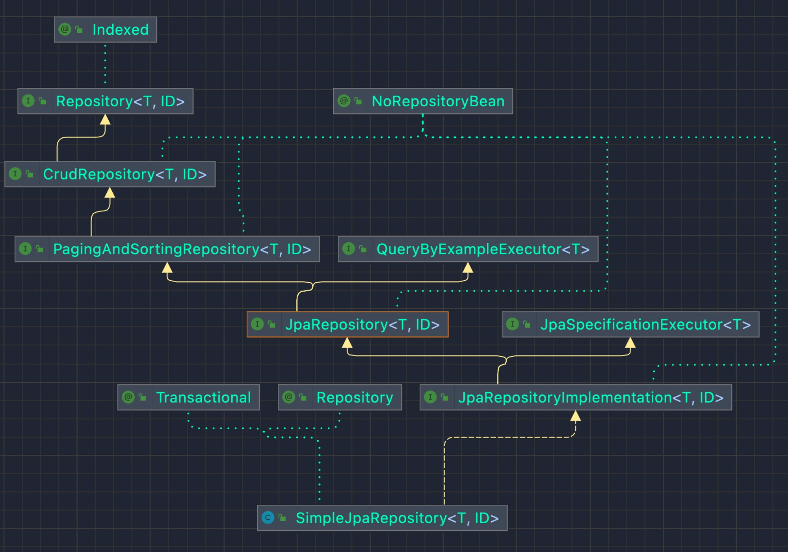

# 0704 스프링정리

## 영속성 컨텍스트의 동작

- JPA는 항상 Entity 객체를 조회할 때, 영속성 컨텍스트를 거쳐서 가져온다.

- JPA는 항상 Entity 객체를 저장할 때, 영속성 컨텍스트를 거쳐서 저장한다.

### 캐싱

- 영속성 컨텍스트 안에 이미 찾고자하는 엔티티가 존재하면 조회쿼리를 실행하지 않음

### 객체동일성 보장 (==)

- 1차 캐시의 사용으로 PK별로 객체가 하나만 생성되는것이 보장된다.

- 따라서 PK별로 동일한 Reference 주소를 가진다. => equal 연산이 보장됨

### 삭제방식

- 영속성 컨텍스트 내부에서 삭제요청된 엔티티는 `DELETE` 표시를 해준다.

- 커밋시점에 해당 상태를 보고 DELETE쿼리 발생

### 쓰기지연 저장소

- JPA는 엔티티의 변경사항과 관련된 SQL을 모아서 한꺼번에 시행한다.

- 이를 **flush** (`em.flush()`) 한다고 한다.

- 의도적으로 flush를 하지 않으면 트랜잭션 커밋시점에 flush가 호출된다.

- 트랜잭션 커밋 메서드 호출 -> 커밋하기전에 flush 호출 -> 트랜잭션 커밋 (영속적용)

- 데이터를 변경하는 SQL을 데이터베이스에 요청 및 반영하기 위해선 Transaction이 필요하다?

    - `SELECT`는 필수는 아니지만 필요할 때가 있다?

### 변경감지

- JPA에서 Update 쿼리를 처리하는 방식

- JPA는 엔티티를 조회할 때, 영속성 컨텍스트의 `loadedState` 에 조회시점의 상태(스냅샷)을 저장함.

- `flush` 시점에 `loadedState`에 있는 상태와, 현재 엔티티 상태를 비교하여 UPDATE 쿼리 생성후 쓰기지연 저장소에 저장

- 이후 `flush`

## 엔티티의 상태

- 영속 상태

    - 영속성 컨텍스트에서 관리하는 상태

    - 영속상 태인 엔티티를 수정했을 때만, 변경감지가 이루어진다.

- 비영속 상태

    - 영속성 컨텍스트와 무관한 그냥 순수한 자바객체들

- 준영속 상태

    - 영속성 컨텍스트에서 관리 되다가 분리된 상태

    - `em.deatch(entity)` : 특정 엔티티를 준영속으로 전환

    - `em.clear()` : 영속성 컨텍스트 초기화 (영속성 컨텍스트에 존재하던 엔티티는 준영속으로 전환)

- 삭제 상태

**[ 참고 ]**

- `em.megre()` : 해당 데이터가 DB에 존재 -> DB에서 가져옴. DB에 없으면 INSERT하고 가져옴.

## 스프링에서의 JPA

- 스프링 환경에서는 영속성 컨텍스트와 트랜잭션의 생명주기가 일치한다.

    - 트랜잭션이 시작되면 영속성 컨텍스트가 생기고, 트랜잭션이 커밋되거나 롤백되면 영속성 컨텍스트는 사라진다. 

- 트랜잭션 전파

    - `@Transactional` 어노테이션은 가장 바깥 메서드에 걸린것이 유효하다.

    - 따라서 Service 계층에서 `@Transactional` 을 걸면 Repository 계층까지 트랜잭션이 전파된다.

    - `@Transactional(propagation = Propagation.REQUIRED)`
    
        - 부모 메서드에 트랜잭션이 존재하면 자식메서드는 부모메서드에 합류한다.

## Spring Data JPA

### Spring Data JPA 동작 원리

아래의 인터페이스는 깡통 인터페이스인데 어떻게 CRUD 메서드를 사용 가능할까?

```java
public interface MemoRepository extends JpaRepository<Memo, Long> {

}
```

- `MemoRepository`의 구현체를 런타임에 스프링 Data Jpa가 만들어준다.

- 이 구현체는 `MemoRepository`의 빈으로 등록한다.

- 이 구현체는 `SimpleJpaRepository` 를 내부에 가지고있다.

    - `SimpleJpaRepository`는 기본적인 CRUD에 대한 메서드를 구현한다.

- 런타임에 생성된 구현체는 `SimpleJpaRepository` 를 이용해서 인터페이스를 구현한다.

### Spring Data JPA 계층도



## JPA Audting

- DB에 레코드 생성시간이나 수정시간을 저장하고 싶을 때 사용

- 자주 사용되서, 아래와같이 추상클래스로 만들어놓고 재사용함

```java
@Getter
@MappedSuperclass
@EntityListeners(AuditingEntityListener.class)
public abstract class Timestamped {
    @CreatedDate
    @Column(updatable = false)
    @Temporal(TemporalType.TIMESTAMP)
    private LocalDateTime createdAt;

    @LastModifiedDate
    @Column
    @Temporal(TemporalType.TIMESTAMP)
    private LocalDateTime modifiedAt;
}
```

- 추가로 `@Configuration`이 붙어있는 클래스에 `@EnableJpaAuditing`를 붙여줘야 적용됨.

## 쿼리메소드

- SpirngDataJpa 에서 메서드 이름으로 SQL을 생성하는 기능

- JpaRepository를 상속한 인터페이스는 런타임에 Spring Data JPA에서 구현체를 만들어준다.

    - 이 때 쿼리메소드의 규칙에 맞게 이름지어진 메서드가 있으면, Spring Data JPA에서 구현해준다.

    - 예시

        - `List<Memo> findAllByOrderByModifiedAtDesc()`

        - `List<Memo> findAllByUsername(String usrename)`